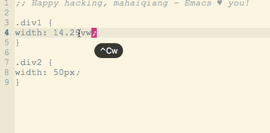

## Introduction
This is a emcas plugin to convert px unit to vw or vh in css or other files.

## How to use

* Download the [px2vw.el](https://github.com/qdhaiqiang/px2vw-emcas-plugin/blob/master/px2vw.el) file to your emcas elisp configuration directory, generally it is `~/.emcas.d/lisp/` in MacOS. Or copy the content of `px-2vw.el` to a `.el` file in emcas el config path, and i suggest to also named `px2vw.el`.

* Add blow code to your emcas config file, `~/.emcas.d/init.el` or `~/.emcas.d/custom.el` are ok.
```
(require 'px2vw)
(global-set-key (kbd "C-c w") 'region-px->vw)
```
Now，you added a shortcut key to emacs, if it is inconvenient, you can set `F9` to do this.
```
(global-set-key [f9] 'region-px->vw)
```

* Move point to width number with "px" unit, and press shortcut key `C-c w`, px unit will convert to vw. For example:
```
.div {
    width: 200px;
}
```
use `C-c w` shortcur key in "200px" chars, it will auto convert to
```
.div {
    width: 13.8889vw;
}
```



## Explaintin

The vw value is convert by expression (/ (* px 100) viewport-width) and maintain four float points.

## Remind

1. I gived default width of viewport is 1440, and not support to change by param, so if you want to change, please modify value of the first line constant `viewpoint-width` in `px2vw.el`.


## Refer
[李杀的Elisp学习笔记](https://emacsist.github.io/2018/01/03/%E6%9D%8E%E6%9D%80%E7%9A%84elisp%E5%AD%A6%E4%B9%A0%E7%AC%94%E8%AE%B0/)
[Emacs Lisp](https://www.gnu.org/software/emacs/manual/html_node/elisp/)
